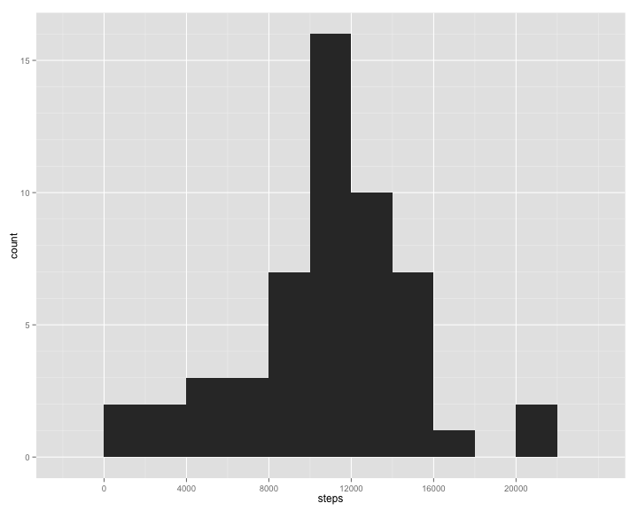
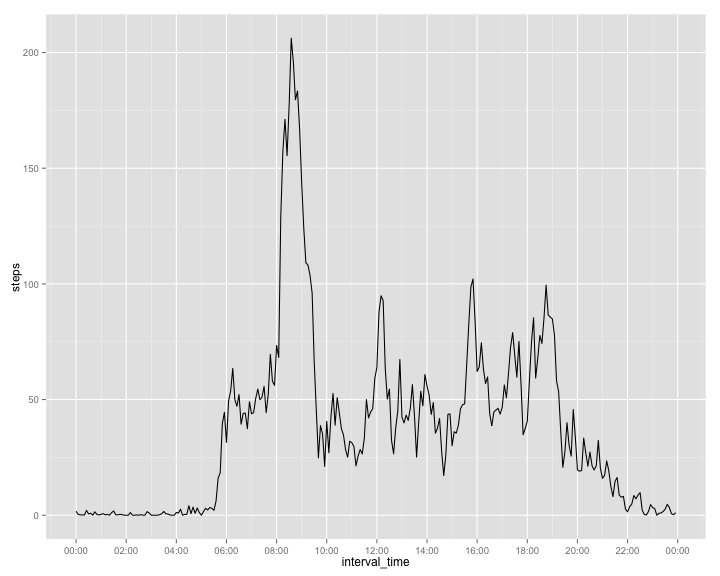
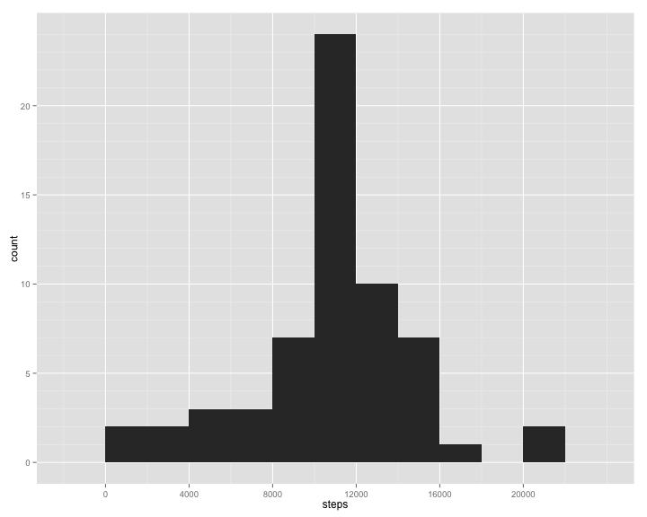
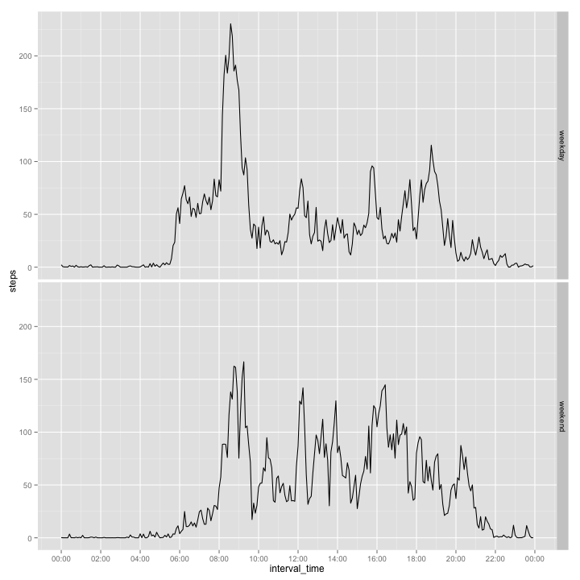

# Reproducible Research: Peer Assessment 1


## Loading and preprocessing the data

```r
library(ggplot2)
library(knitr)
library(scales)

data <- read.csv(unz("activity.zip", "activity.csv"), colClasses = c("numeric", 
    "Date", "numeric"))
daily <- aggregate(steps ~ date, data = data, FUN = sum)
```


## What is the mean total number of steps taken per day?

```r
hist1 <- qplot(steps, data = daily, binwidth = 2000)
hist1 + scale_y_continuous(breaks = seq(0, 16, 5), minor_breaks = seq(0, 16, 
    1)) + scale_x_continuous(breaks = seq(0, 20000, 4000))
```

 


```r
mean(daily$steps, na.rm = TRUE)
```

```
## [1] 10766
```

```r
median(daily$steps, na.rm = TRUE)
```

```
## [1] 10765
```


## What is the average daily activity pattern?

```r
daily2 <- aggregate(steps ~ interval, data = data, FUN = mean)
daily2 <- transform(daily2, interval_time = strptime(sprintf("%04d", interval), 
    "%H%M"))
tseries <- qplot(interval_time, steps, data = daily2, geom = "line")
tseries + scale_x_datetime(breaks = "2 hours", labels = date_format("%H:%M"))
```

 


```r
daily2[which.max(daily2$steps), c(1, 2)]
```

```
##     interval steps
## 104      835 206.2
```


## Imputing missing values

```r
na_index = is.na(data$steps)
sum(na_index)
```

```
## [1] 2304
```


For any missing data, fill in the average of that 5-minutes interval, calculated in the last section.


```r
imputed <- data
imputed[na_index, "steps"] = rep(daily2$steps, length.out = nrow(data))[na_index]
```


```r
daily_imputed <- aggregate(steps ~ date, data = daily_imputed, FUN = sum)
hist2 <- qplot(steps, data = daily_imputed, binwidth = 2000)
hist2 + scale_y_continuous(breaks = seq(0, 24, 5), minor_breaks = seq(0, 24, 
    1)) + scale_x_continuous(breaks = seq(0, 20000, 4000))
```

 


Since we're only replacing the missing data with the existing average, and that missing values appear in groups of entire days (i.e. either a whole day of data is missing, or no data is missing), the above histogram shows that after imputing, those days originally missing data now have a total steps number equal to the average number of total steps in a day.


```r
mean(daily_imputed$steps)
```

```
## [1] 10766
```

```r
median(daily_imputed$steps)
```

```
## [1] 10766
```


This method of imputing data does not affect the estimation of the total number of steps taken each day.  That is, the mean of total steps per day is unchanged.  On the other hand, the median has changed and is now equal to the mean, because there are now a lot more days with steps sum equal to the mean.


## Are there differences in activity patterns between weekdays and weekends?


```r
imputed$weekend <- as.numeric(format(imputed$date, "%u"))
imputed[imputed$weekend > 5, "weekend"] <- "weekend"
imputed[imputed$weekend != "weekend", "weekend"] <- "weekday"
imputed$weekend <- as.factor(imputed$weekend)
```


```r
imputed <- transform(imputed, interval_time = strptime(sprintf("%04d", interval), 
    "%H%M"))

tseries2 <- ggplot(imputed, aes(interval_time, steps))
tseries2 + stat_summary(fun.y = "mean", geom = "line") + facet_grid(weekend ~ 
    .) + scale_x_datetime(breaks = "2 hours", labels = date_format("%H:%M"))
```

 


